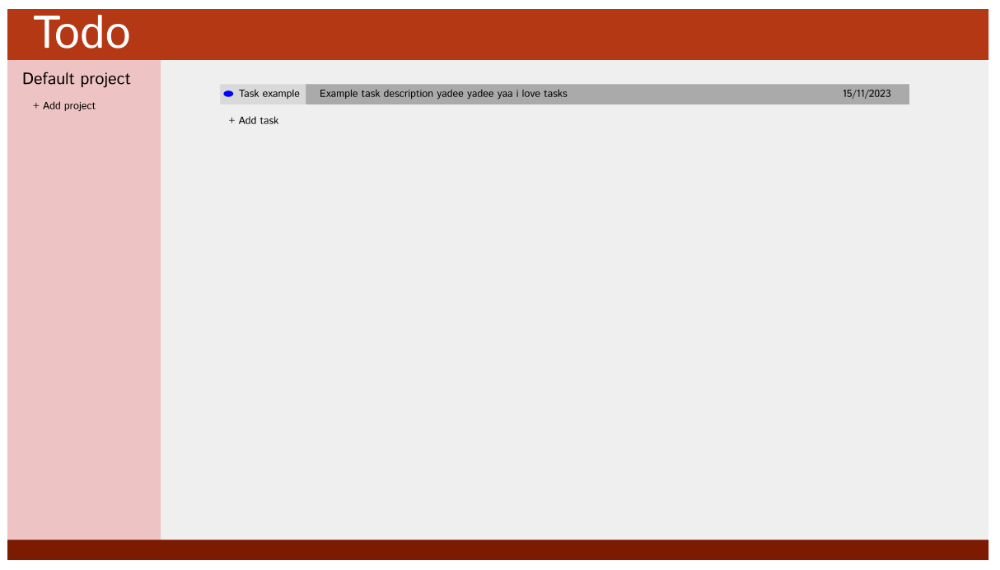

# todo-list

[Link to live page](https://mattyjrae123.github.io/todo-list/)

This project is part of 'The Odin Project' javascript course. It's a browser based Todo List app. 

I'll be using HTML, CSS and JS but also utilising node and webpack for development tools. As the scope of this project is significantly larger than previous projects, this is a good opportunity to put everything I've learned up until this point together.

## Plan
- Design basic UI with Figma
- Design backend
- Build UI with HTMl/CSS
- Build functionality with JS
- MVC pattern (controller knows about model and view, but model and view only know about themselves)

### Initial Project Scope:
- Todo 'tasks' should have a title, description, dueDate and priority
- Todo 'tasks' should be split into 'projects' or seperate 'lists
- Projects can be created/deleted by the user
- Todo tasks can be created/deleted by the user
- Seperate application logic from UI logic using modules
- 

### Advanced Scope:
- Data persistence using localStorage

### Model
- Store array of projects
- Each project is an object containing a title and an array of tasks
-  Each task is an object containing title, description, dueDate, priority and ID (ID for plumbing between task and UI element)

### View
- Generate HTML elements for project lists on page load, adding project or deleting project
- Generate HTML elements for project tasks on page load (default project), adding task, deleting task, editing task, changing displayed project

### Controller
- Contains 'model' and 'view' objects and coordinates functionality of the site.
- On load, start functions to generate project list and load default projects todo tasks.

#### Rough design (ignore colours)

#### Rough Flow
-
- Set up M/V/C objects
- - Controller gets projects from Model
- - Controller sends projects to View to display

- Model
- - Projects object with array of project items, title, unique ID

- Page Load
- - M/V/C Object set up
- - - Controller creates event listeners and send references to view
- - - Controller checks if projects exist (ADD AFTER DATA PERSISTENCE FUNCTIONALITY IS ADDED)
- - - If not, ask Model to create default project
- - - Controller gets projects list and sends to View
- - - View creates project HTML elements
- - - View adds event listeners
- - - View adds to DOM

- Project clicked (EVENT LISTENER)
- - Controller gets project ID from event
- - Controller gets project object from Model using ID
- - Controller sends project object (or just array of items?) to View
- - View creates item HTML elements
- - View adds event listeners
- - View adds to DOM

- Project item Deleted (EVENT LISTENER)
- - Controller gets project and item IDs from event
- - Controller asks Model to delete item, using IDs
- - Controller gets Item list from Model
- - Controller sends Item list to View to display

- Project item Completed (EVENT LISTENER)
- - Controller gets project and item IDs from event
- - Controller asks model to set item complete
- - Controller gets Item List from Model
- - Controller sends Item list to View to display

- Add List clicked (EVENT LISTENER)
- - Unhide modal DOM elements with CSS class

- Add List ADD clicked (EVENT LISTENER)
- - Controller gets new title from DOM element
- - Controller asks Model to create new list
- - Controller gets list of projects from Model
- - Controller sends projects to view to display

- Add List CANCEL clicked (EVENT LISTENER)
- - Hide Modal DOM elements

- Add Item clicked (EVENT LISTENER)
- - Unhide DOM elements with CSS class

- Add Item ADD clicked (EVENT LISTENER)
- - Controller gets priority, title, description, date, list ID from DOM element
- - Controller asks Model to create new item in the list
- - Controller gets project object from Model
- - Controller sends project object to view to display

- Add Item CANCEL clicked (EVENT LISTENER)
- - Hide modal DOM elements

- Delete list clicked
- - Controller gets list ID from event
- - Controller asks Model to delete list
- - Controller gets list of projects from Model
- - Controller sends projects to view to display
